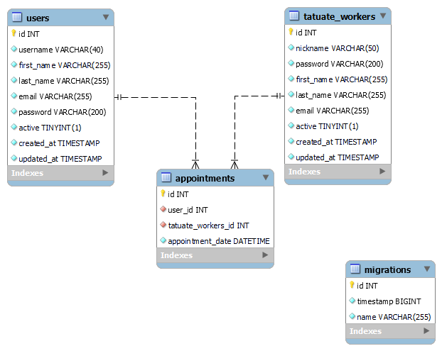

# JK_TATUATE

<details>
  <summary>Contenido 📝</summary>
  <ol>
    <li><a href="#objetivo">Objetivo</a></li>
    <li><a href="#sobre-el-proyecto">Sobre el proyecto</a></li>
    <li><a href="#stack">Stack</a></li>
    <li><a href="#diagrama-bd">Diagrama</a></li>
    <li><a href="#instalación-en-local">Instalación</a></li>
    <li><a href="#endpoints">Endpoints</a></li>
    <li><a href="#futuras-funcionalidades">Futuras funcionalidades</a></li>
    <li><a href="#licencia">Licencia</a></li>
    <li><a href="#agradecimientos">Agradecimientos</a></li>
   
  </ol>
</details>

## Objetivo

Este proyecto requería una API funcional conectada a una base de datos.

## Sobre el proyecto

Decidí crear una aplicación web para ayudar a los amantes de los tatuajes, en donde les sea mas facil crear, modificar y borrar citas, asi como ver que citas son las que tiene. Todo con la intencion de aprovechar el tiempo pues es estos dias el tiempo es oro.

## Stack

Tecnologías utilizadas:

<div align="center">
<a href="https://www.mysql.com/">
    
</a>
<a href="https://www.expressjs.com/">
    
</a>
<a href="https://nodejs.org/es/">
    
</a>
<a href="https://developer.mozilla.org/es/docs/Web/JavaScript">
    
</a>
 </div>

## Diagrama BD



## Instalación en local

1. Clonar el repositorio
2. `$ npm install`
3. Conectamos nuestro repositorio con la base de datos
4. `$ Ejecutamos las migraciones`
5. `$ npm run dev`

## Endpoints

<details>
<summary>Endpoints</summary>

- AUTH

- REGISTER USER

           POST http://localhost:3000/authUser/register
       body:
       ``` js
           {
               "username": "tate",
                "first_name": "logan",
                "last_name": "morrison",
                "email": "logan@gmail.com",
                "password": "12345678"
           }
       ```

  - LOGIN

          POST http://localhost:3000/users/login

    body:

    ```js
        {

         "email": "romeroz@gmail.com",
         "password": "12345678"


        }
    ```

  - USER PROFILE

          GET http://localhost:3000/api/users/1

  - UPDATE PROFILE

          PATCH http://localhost:3000/api/users/10

    body:

    ```js
         {
         "username": "ydy",
         "first_name": "marleydy",
         "last_name": "romero",
         "email": "romerz@gmail.com",
         "password": "12345678"
        }
    ```

  - APPOINTMENT CREATION

          POST http://localhost:3000/appointments/

    body:

    ```js
        {

              "user_id": 1,
              "tatuate_workers_id": 1,
              "appointment_date": "2024-04-17 10:30:00"

        }
    ```

  - APPOINTMENT UPDATE

          PATCH http://localhost:3000/appointment/1

    body:

    ```js
        {

              "user_id": 1,
              "tatuate_workers": 2,
              "appointment_date": "2024-04-14 12:30:00"

        }
    ```

  - APPOINTMENT DELETE

         DELETE http://localhost:3000/appointment/1

  - APPOINTMENT FOR USERS

         GET http://localhost:3000/appointment/users/1

  - APPOINTMENT FOR TATUATE_WORKERS

         GET http://localhost:3000/appointment/worker/1

  </details>
  ```

## Futuras funcionalidades
 
[ ] Añadir admin, superadmin 
[ ] Crear Galeria de tatuajes


## Licencia

Este proyecto se encuentra bajo licencia de "Marlendyz Herlendyz Perez Romero"


## Agradecimientos:

Agradezco a mi compañeros el tiempo dedicado a este proyecto:

- _Reynaldo_  
  <a href="https://github.com/ReynaldoMunozF" target="_blank"></a>
